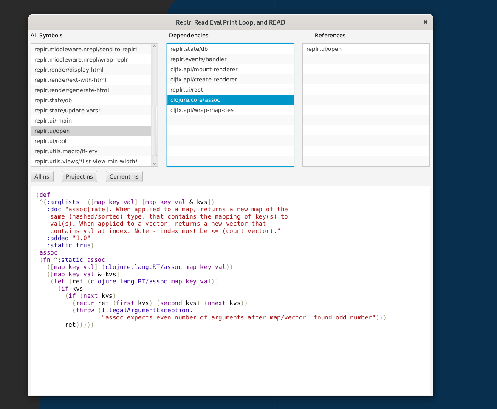
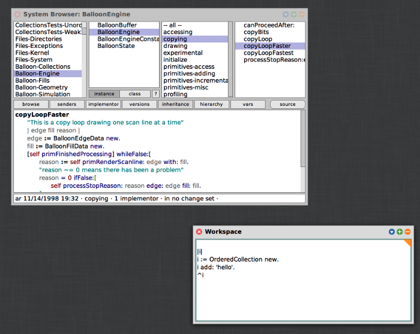

# REPLR

[](https://clojars.org/replr)

*Read* Eval Print Loop **and Read**!! UI to help you read your codebase!


*Initial layout of REPLR.*

- First pane will list all the symbols available on your load-class.
- If you click in any function in the **first** pane, the **second** will show its function dependencies
- If you click in any function in the **first** pane, the **third** will show the functions that is using you (references)
- If you click in any function in the **second** pane, the **third** will show the functions that is using you (references)

## Instalation

``` clojure
[replr "0.1.0"]
```

There is already a nrepl middleware implemented that need to be used
if you desired to have instant feedback when a new function is created
or changed inside the project.

Add the following lines to your `project.clj`.

``` clojure
:repl-options {:nrepl-middleware [replr.middleware.nrepl/wrap-replr]}
```

## Motivation

I read an interesting essay entitled [Design Patterns, Smalltalk, and the Lost Art of Reading Code](https://medium.com/@kylegenebrown/design-patterns-smalltalk-and-the-lost-art-of-reading-code-1727d93fd7fa) and I liked the idea of _reading your source code_ as a main source of building block to keep moving forward with your application.

This project has no pretension (yet! (: ) to provide the same
flexibility as is described about the Smalltalk entire
environment. However, I am often caught by surprise about the amount
of code I depend on because I wanted to use that single nice function
that helps me accomplish the task of the day.



*Squeak Smalltak showing 4-pane browser and workspace. From essay.*

The idea is to provide some visibility about the entire load class
available for you to use in your clojure project.


#### TODO

The free area in the right side is waiting for more
functionalities. Up to now, I thought about the display of a
dependency graph for the selected functions.

## License

Copyright 2020 Wanderson Ferreira

This program and the accompanying materials are made available under the
terms of the Eclipse Public License 2.0 which is available at
http://www.eclipse.org/legal/epl-2.0.

This Source Code may also be made available under the following Secondary
Licenses when the conditions for such availability set forth in the Eclipse
Public License, v. 2.0 are satisfied: GNU General Public License as published by
the Free Software Foundation, either version 2 of the License, or (at your
option) any later version, with the GNU Classpath Exception which is available
at https://www.gnu.org/software/classpath/license.html.
